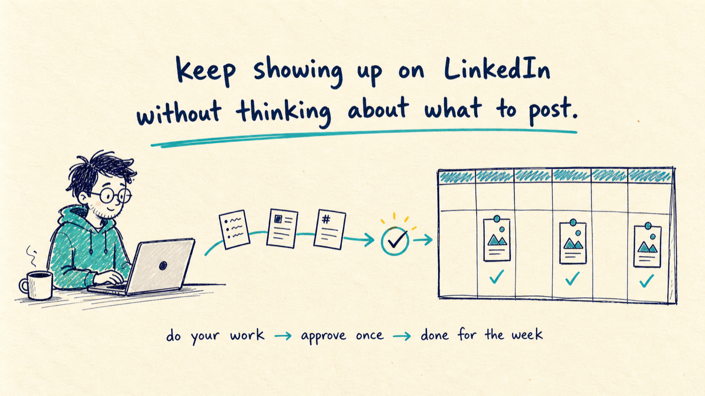

# ContextQuill

<p align="center">
  
</p>

<p align="center">
  Turn the work you already do into thoughtful LinkedIn posts — then review, schedule, publish, and learn what earns attention.
</p>

<p align="center">
  <a href="https://github.com/pitacodes/contextquill/releases/latest"></a>
  <a href="https://github.com/pitacodes/contextquill/actions/workflows/ci.yml"></a>
  <a href="LICENSE"></a>
  
</p>

<p align="center">
  
</p>

<p align="center">
  <a href="INSTALL.md"><strong>Install ContextQuill in five minutes →</strong></a>
  ·
  <a href="https://github.com/pitacodes/contextquill/releases/latest"><strong>Download the latest release →</strong></a>
</p>

ContextQuill is a small, free, open-source side project for people who already spend their day in Codex, ChatGPT Work, Claude Code, or Claude Cowork. I built it because I wanted to keep posting on LinkedIn without adding “think of something to post” to my weekly to-do list.

It notices ideas inside the work you are already doing, turns the useful ones into drafts, and waits for you to approve the exact final version. Approve a few at once, schedule them, and get back to work.

## That is the whole idea

Your best posts are probably already hiding in work you finished:

- You solved a difficult customer problem.
- You noticed a pattern across several conversations.
- You made a product decision and learned from the trade-off.
- You found an industry change that matters to your buyers.
- You finished an analysis other people would genuinely find useful.

ContextQuill turns those moments into a small queue of drafts and waits for your explicit approval before anything can be published.

> Keep doing your work. Let LinkedIn stay alive in the background.

Try it for one week: tell ContextQuill what you care about once, let it collect useful ideas while you work, then approve and schedule a small batch. No content calendar. No daily brainstorming ritual. No pretending the project is a marketing department.

## Why people use it

- **No blank-page problem.** Content ideas come from work you already completed.
- **Your judgment stays visible.** Drafts preserve the decision, trade-off, or lesson instead of flattening it into AI filler.
- **Human approval is mandatory.** ContextQuill cannot publish a draft until you type its exact one-time approval phrase.
- **Scheduling is built in.** Approve a batch once and let ContextQuill publish the exact locked versions at the chosen times.
- **It learns from results.** Add post metrics and get topic, format, hook, and weekday recommendations with confidence labels.
- **Local-first by default.** Drafts and source signals stay on your computer; LinkedIn credentials live in the operating system's secure credential store where supported.

## Get ContextQuill

### Codex and ChatGPT Work

Add the public marketplace and install the plugin:

```bash
codex plugin marketplace add pitacodes/contextquill
codex plugin add contextquill@contextquill
```

Start a new task after installation. ContextQuill is then available in ChatGPT Work and Codex surfaces that support plugins. You can also browse plugins from Codex CLI with `/plugins`.

### Claude Code and Claude Cowork

ContextQuill also ships an Anthropic-compatible plugin manifest and marketplace:

```text
/plugin marketplace add pitacodes/contextquill
/plugin install contextquill@contextquill
```

Restart the session or run `/reload-plugins` if Claude asks you to. Local MCP-backed tools require a desktop/local session; cloud-only Cowork sessions require a publicly hosted MCP server, which is not part of this local-first release.

### Direct download

Download **`contextquill-plugin.zip`** from the [latest GitHub release](https://github.com/pitacodes/contextquill/releases/latest). The archive is ready for custom-plugin upload in clients that support plugin ZIPs and can also be extracted for local MCP use.

For an offline-style Codex marketplace folder, download **`contextquill-codex-marketplace.zip`**, extract it, then run:

```bash
codex plugin marketplace add /absolute/path/to/contextquill-marketplace
codex plugin add contextquill@contextquill-local
```

See [Installation](INSTALL.md) for detailed setup, upgrades, platform notes, and manual MCP configuration.

## Your first five minutes

Open a new task and say:

```text
Use ContextQuill. Set up my positioning for LinkedIn, connect my account,
and look for one strong content signal in the work we just completed.
```

Then try:

- “Turn this week's best three work insights into LinkedIn drafts.”
- “Show me the exact final versions for review.”
- “Schedule the approved posts for Tuesday, Wednesday, and Thursday at 9:00 AM.”
- “Analyze my recent post metrics and propose next week's content mix.”

The first LinkedIn connection opens the official LinkedIn authorization flow. Every installation connects only the account that its own user authorizes.

## How the loop works

```text
REAL WORK
   ↓
CAPTURE useful signals with minimal, public-safe context
   ↓
DRAFT in your positioning, voice, and content pillars
   ↓
REVIEW the complete post, links, images, and safety notes
   ↓
APPROVE the exact locked version with a one-time phrase
   ↓
PUBLISH now or SCHEDULE for later
   ↓
LEARN from impressions, engagement, and qualified leads
```

Any edit after approval automatically revokes approval and returns the post to draft. There is no “quietly changed after I approved it” path.

## What is included

- Content profile: positioning, audience, goals, pillars, voice, and disclosure boundaries
- Signal inbox for insights found in customer work, analysis, news, and retrospectives
- Draft library with stable labels for topic, format, content type, and hook style
- Confidentiality checks and anonymous-by-default customer cases
- Exact content-hash approval lock and audit trail
- Immediate and scheduled LinkedIn publishing
- Text and single-image posts through LinkedIn's official API
- Exposure, engagement, clicks, follows, and attributed-lead tracking
- Small-sample-aware recommendations so one lucky post does not rewrite the whole strategy
- Open MCP tools that can be used from more than one work agent

## A low-effort weekly rhythm

1. Let ContextQuill capture strong signals while you work.
2. Once a week, ask it to choose the five best signals.
3. Review three finished posts instead of brainstorming from scratch.
4. Approve the exact versions you are comfortable publishing.
5. Schedule them across the week.
6. Add metrics later and let the next batch adapt.

The human attention goes into judgment and approval, not moving ideas between apps.

See [Automation playbook](docs/AUTOMATION_PLAYBOOK.md) for ready-to-use weekly and daily task prompts.

## Safety model

ContextQuill is intentionally conservative about publishing:

- It never invents customer stories, results, quotations, or personal experiences.
- Customer cases are anonymous unless public evidence or explicit permission is recorded.
- It never scrapes LinkedIn or uses browser cookies.
- It never returns a LinkedIn access token through an MCP tool.
- It cannot approve a draft on the user's behalf.
- Scheduled publishing only accepts an already approved, hash-locked draft.

Read [Privacy](PRIVACY.md), [Security](SECURITY.md), and the [OAuth architecture](docs/linkedin-oauth-architecture.md) before using it with sensitive work.

## LinkedIn connection and scheduling

ContextQuill uses LinkedIn's official OAuth and publishing APIs. On macOS, the connected account token is stored in Keychain. Other operating systems can use `LINKEDIN_MEMBER_URN` and `LINKEDIN_ACCESS_TOKEN` through the MCP process environment.

The hosted OAuth handoff only performs the short-lived code exchange. It does not store drafts or become a long-term token vault. The production handoff service is checked as part of release readiness.

Local scheduling runs while the ContextQuill MCP process is active. If the agent is closed at the scheduled time, an overdue approved post is retried the next time ContextQuill starts. Hosted, always-on scheduling is on the roadmap.

## Work-agent compatibility

| Agent | Install path | Content workflow | Local scheduling | Notes |
|---|---|---:|---:|---|
| Codex | Public plugin marketplace | Full | Yes | Recommended path |
| ChatGPT Work | Shared OpenAI plugin catalog / installed plugin | Full | Yes, when the local MCP host is active | Start a new task after install |
| Claude Code | GitHub plugin marketplace | Full | Yes | Uses the bundled local MCP server |
| Claude Cowork | Custom plugin on desktop/local sessions | Full | Yes | Cloud-only sessions need a remote MCP deployment |
| Other MCP clients | Manual stdio configuration | Full | Yes | Point the client at `mcp/server.mjs` |

See [Using ContextQuill with work agents](docs/WORK_AGENTS.md) for exact configuration and workflow examples.

## Local development

Requirements: Node.js 20 or later.

```bash
git clone https://github.com/pitacodes/contextquill.git
cd contextquill
npm test
npm run doctor
```

The local MCP server has no third-party runtime dependencies. The separately deployed OAuth handoff service lives under `oauth-service/` and has its own build and tests.

To build the two downloadable release archives:

```bash
npm run package
```

## Project status

ContextQuill is an open-source beta. Text and one-image publishing work today. Personal-post metrics are imported rather than scraped. Video, PDF/carousel publishing, automatic analytics sync, and hosted scheduling remain future work.

See [Roadmap](docs/ROADMAP.md) and [Changelog](CHANGELOG.md).

## Built by Peter Zhang

I built ContextQuill because the most credible B2B content usually already exists inside the work: a hard decision, a recurring customer pattern, a useful operating method, or a lesson earned the expensive way. The problem is consistently noticing and publishing it without turning content creation into another full-time job.

If ContextQuill helps you publish something worthwhile, please star the repository, share what worked, or open an issue with your workflow. That feedback will shape what I build next.

## Contributing

Issues and pull requests are welcome. Please read [Contributing](CONTRIBUTING.md) and [Security](SECURITY.md). ContextQuill is released under the [MIT License](LICENSE).
